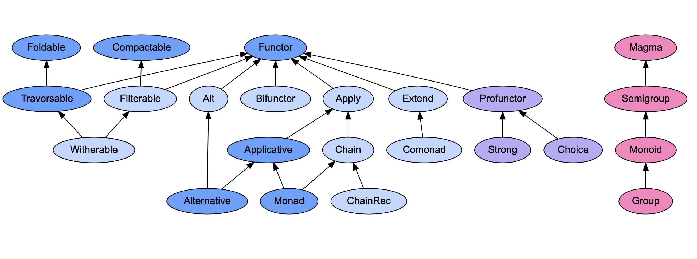
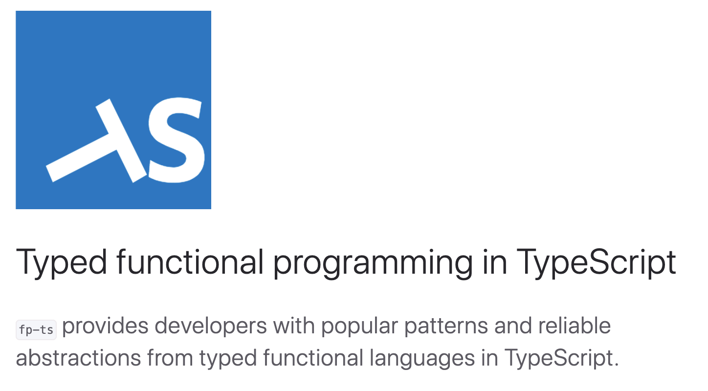

build-lists: true
autoscale: true

## 3 suggestions to start with FP

## in `Typescript` and `fp-ts`
<!-- # Intro to Functional Programming with `TypeScript` and `fp-ts` -->

---

# Intro to FP

| OO                   | FP       |
| -------------------- | -------- |
| Dependency Injection | Function |
| Visitor Pattern      | Function |
| Decorator            | Function |
| Middleware           | Function |
| Factory              | Function |

---

# Reality

| JS/TS                | FP       |
| -------------------- | -------- |
| Class                | Function |
| Instance             | Function |
| Dependency Injection | Function |
| Decorator            | Function |
| Middleware           | Function |
| node APIs            | Function |
| DOM APIs             | Function |

---

### [fit] HKT

---

### [fit] ADT

---

### [fit] Monoid

---

### [fit] Functor

---



---

[.build-lists: false]
[.list: alignment(left)]

# Agenda

<br />

1. Typed functional programming

2. Designing with types

3. Functional error handling

---



---

[.build-lists: false]
[.list: alignment(left)]

# Typed functional programming

<br />

1. forget about a lot of concepts: classes, inheritance, decorators...
2. focus on **data** and **functions** only
3. profit!

---

[.list: alignment(left)]

# Data

<br />

- plain values, no behavior attached
- generally immutable:
  - different value ⟺ different reference

---

[.list: alignment(left)]

# Functions

<br />

- in the mathematical sense: no "impure" or "side-effectful" functions
- relation associating each element of the _domain_ to a single element of the _codomain_
- "total": defined for every value of the _domain_

---

[.list: alignment(left)]

## Typed functional programming in TS - Rules

- `"strict": true` in _tsconfig.json_
- annotate function return types (`void` not allowed!)
- define `total` functions
- when possible, prefer `polymorphic` functions
- use "type driven development": _`declare function`_

---

[.build-lists: false]
[.list: alignment(left)]

## Typed ~~functional~~ programming in TS - Rules

- `"strict": true` in _tsconfig.json_
- annotate function return types (`void` not allowed!)
- define `total` functions
- when possible, prefer `polymorphic` functions
- use "type driven development": _`declare function`_

---

## Are these signatures OK?

<br />

```ts
declare function sum(a: number, b: number): number

declare function length(a: string): number

declare function replicate<A>(a: A, n: number): Array<A>
```

---

## Are these signatures OK?

<br />

```ts
declare function parseInt2(s: string): number

declare function head<A>(as: Array<A>): A
```

---

## Suggestion #1

<br />

Good FP in TS rules are just good TS rules

# To start with FP in TS,

# let the signatures talk straight

---

[.list: alignment(left)]

# Designing with types

`SubscriptionStatus`

- for the user to access the service, email must be verified
- the "Solo" plan is completely free
- the "Business" plan costs money, so any "Business" user should have selected a payment mode

---

# Product type

<br />

```ts
type SubscriptionStatus = {
  emailVerified: boolean
  subscriptionTier: "Solo" | "Business"
  paymentMode?: "Cash" | "Credit"
}
```

---

# Product type

<br />

```ts
type SubscriptionStatus = {
  emailVerified: boolean // # = 2
  subscriptionTier: "Solo" | "Business" // # = 2
  paymentMode?: "Cash" | "Credit" // # = 3
}
```

---

# Product type

<br />

```ts
type SubscriptionStatus = {
  emailVerified: boolean // # = 2
  subscriptionTier: "Solo" | "Business" // # = 2
  paymentMode?: "Cash" | "Credit" // # = 3
}
```

representable states: **2 * 2 * 3 = 12**

---

# Impossible! ❌

<br />

```ts
const impossibleStatus: SubscriptionStatus = {
  emailVerified: false,
  subscriptionTier: "Business",
  paymentMode: undefined
}
```

---

# Make impossible states irrepresentable

```ts
interface NotVerified {
  type: "NotVerified"
}

interface Solo {
  type: "Solo"
}

interface Business {
  type: "Business"
  paymentMode: "Cash" | "Credit"
}

type SubscriptionStatus = NotVerified | Solo | Business
```

---

# Sum type


```ts
interface NotVerified // # = 1

interface Solo // # = 1

interface Business // # = 2

type SubscriptionStatus = NotVerified | Solo | Business
```

---

# Sum type

```ts
interface NotVerified // # = 1

interface Solo // # = 1

interface Business // # = 2

type SubscriptionStatus = NotVerified | Solo | Business
```

representable states: **1 + 1 + 2 = 4** ✅

---

# Exhaustiveness checking

```ts
function isCool(status: SubscriptionStatus): boolean {
  switch (status.type) {
    case "Business":
      return status.paymentMode === "Credit";
    case "Solo":
      return true;
    case "NotVerified":
      return false;
  }
}
```

---

# **fold**/**match** function

<br />

```ts
declare function foldSubscriptionStatus<T>(
  status: SubscriptionStatus,
  onNotVerified: () => T,
  onSolo: () => T,
  onBusiness: (paymentMode: Business["paymentMode"]) => T
): T
```

---

## Suggestion #2

<br />

Safe code requires safe design upfront

# To start with FP in TS,

# reason in terms of **sum** and **product** types

---

# Function composition

<br />

```ts
function toUpperCase(s: string): string
function toChars(s: string): Array<string>

const result1 = toChars(toUpperCase("foo"))
```

---

# Function composition with **|>**

<br />

```ts
function toUpperCase(s: string): string
function toChars(s: string): Array<string>
```
```ts
const result2 =
    "foo"
    |> toUpperCase
    |> toChars
```

---

# Function composition in **fp-ts**

<br />

```ts
function toUpperCase(s: string): string
function toChars(s: string): Array<string>
```
```ts
const result3 = pipe(
    "foo",
    toUpperCase,
    toChars
)
```

---

# Error handling - the FP way

## fp-ts **Option**

<br />

```ts
import * as O from 'fp-ts/lib/Option'
```

---

# Error handling - the FP way

## fp-ts **Option**

<br />

```ts
function parseInt2(s: string): O.Option<number>
```

---

# Error handling - the FP way

<br />

```ts
function parseInt2(s: string): O.Option<number> {
  const parsed = parseInt(s)
  return isNaN(parsed) ? O.none : O.some(parsed)
}
```

---

# Error handling - the FP way

<br />

```ts
function head<A>(as: Array<A>): O.Option<A> {
  return as.length >= 1 ? O.some(as[0]) : O.none
}
```

<br />

(`import { head } from 'fp-ts/lib/Array'`)

---

# Option is a sum type

```ts
type Option<A> = None | Some<A>

interface None {
  _tag: "None"
}

interface Some<A> {
  _tag: "Some"
  value: A
}
```

---

# Error handling - the FP way

```ts
type User = { first: string; last: string }
declare const ranking: Array<User>
```

```ts
import * as O from "fp-ts/lib/Option"

const winner1 = pipe(
  ranking,
  head,
  O.fold(
    () => "Everybody wins!",
    user => `${user.first} ${user.last}`
  )
)
```

---

# Interoperating with non-FP code

```ts
declare const possiblyNull: string | null

O.fromNullable(possiblyNull) // => Option<string>

const chars: Array<string> = pipe(
  possiblyNull,
  O.fromNullable,
  O.map(toUpperCase),
  O.map(toChars),
  O.fold(() => [], identity) // same as O.getOrElse(() => [])
)
```

---

[.list: alignment(left)]

# Why is **Option** better?

compared to e.g. `A | null`

- "standard" in FP, e.g. Scala or Purescript: `data Maybe a = Nothing | Just a`
- shares the same interface as any other FP data type - learn once, use anywhere

---

# Why is **X** from **fp-ts** better?

```ts
const result1: number = pipe(
  "not number",
  parseInt2,
  O.getOrElse(() => 0)
)
```

```ts
import * as E from "fp-ts/lib/Either"
```
```ts
type Fail = "Invalid" | "TooMuch"

function parseInt3(s: string): E.Either<Fail, number>
```

---

# Why is **X** from **fp-ts** better?

```diff
  pipe(
    "not number",
-   parseInt2,
+   parseInt3,
-   O.map(n => n * 2),
+   E.map(n => n * 2),
-   O.getOrElse(() => 0)
+   E.getOrElse(() => 0)
  )
```

---

## Suggestion #3

<br />

Write 100% FP code from day 1 is not possible

# In **fp-ts**,

# start from low hanging fruits like **Option**

---

[.list: alignment(left)]

## Summary

## To start with FP in TS, using **fp-ts**

1. Let the signatures talk straight
2. Reason in terms of `sum` and `product` types
3. Start from the low hanging fruits like `Option`

---

### [@giogonzo](https://twitter.com/giogonzo)

## **any** question?


